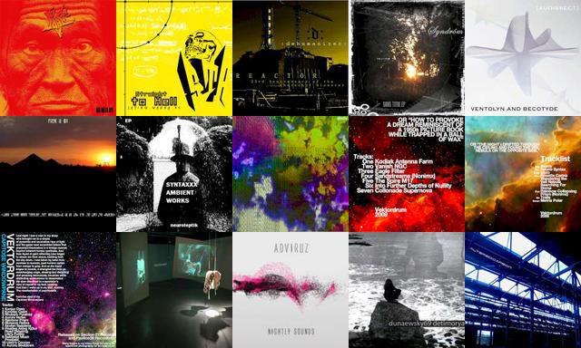

# cavae
Covert art variational autoencoder for generating new cover art

## Setup
```
get the code
$ git clone https://github.com/csteinmetz1/cavae

create a virtual env
$ virtualenv cavae_env 
$ source cavae_env/bin/activate

install dependancies 
$ pip install -r requirements.txt
```

## Dataset
I am using a very small subset of the albums covers in [this dataset](https://archive.org/details/audio-covers), which contains over 1 million album covers.
The dataset is split up into smaller .tar files by filename. I am using `album_covers_s.tar`, but feel free to use any or all of the archives.

## Preprocessing
The dataset is quite messy and includes a lot of non-album cover images (different file formats, dead link images, non-square images, etc.), so to clean up the dataset for this project I created a script, `clean.py`, that iterates over every (.jpg) image in the user specified directory and does the following.

* Check the dimensions - if not 1:1 aspect ratio discard the image
* Resize the image - there is small ( 28, 28 ) and large ( 128, 128 )
* Save the new images - user specificed output directory

Note: It took a significant amount of time to process all 100,000 images in `album_covers_s.tar`, about 1 hour.



Here are some of the actual size ( 128, 128 ) covers after preprocessing.

## Model

